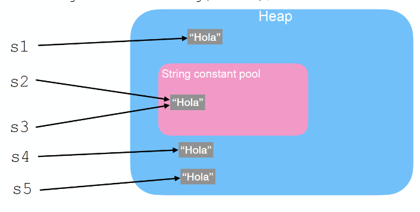

# Tema 1

## 1.1 Introducció

- Programa: conjunt d'instruccions i dades que poden ser executades per un computador per a solucionar un problema concret.
- Estructura de dades: Entitats definides en un programa per emmagatzemar les dades.


## 1.2 Estructura d'un programa java

Directives Inicials: importacions

Inici mètode prinicipal: Public static void main(String[] args)

fi del mètode principal: "}"

Altres mètodes: Són opcionals depenent del programa i poden ser executats dins del main() si estan dins de la mateixa classe o comparteixen jerarquia,

## 1.3 Variables i Constants

- Variables: el valor canvia durant l'execució.

- Constants: El valor és el que es queda al final. (final int PI = 3.14159), noms en majúscules.

## 1.4 Tipus de dades

- Statiques: Es declaren abans.
- Dinàmiques: Es coneix el tipus en temps d'execució.

### Primitius vs Referència
- Primitius: byte, short, int, long, float, double, char, boolean.(camelCase). Si canviem de variable es copia el valor.

- Referència: objectes d'una classe, com per exemple una String. (PascalNomeclatura). Si canviem de variable es copia la referència, no el valor.

Exemple d'ús de la classe Math:

```java
public class EjemploMath {
    public static void main(String[] args) {
        double seno = Math.sin(Math.PI / 2);
        double coseno = Math.cos(Math.PI);
        double numero = 5.678;
        double redondeoArriba = Math.ceil(numero);
        double redondeoAbajo = Math.floor(numero);
        double redondeoCercano = Math.round(numero);

        System.out.println("Constant PI: " + Math.PI);
        System.out.printf("Constant PI amb dos decimals: %.2f\n", Math.PI);
        System.out.println("Seno de PI/2: " + seno + " Coseno de PI: " + coseno);
        System.out.println("Numero decimal: " + numero + " RedondeoArriba: " + redondeoArriba
                + " RedondeoAbajo: " + redondeoAbajo
                + " RedondeoCercano: " + redondeoCercano);
        System.out.println("Raiz cuadradada de 16: " + Math.sqrt(16));
        System.out.println("Maximo(10,20): " + Math.max(10, 20) + " Minimo(-5,2): " + Math.min(-5, 2));
        System.out.println("Potencia 2 elevado a 3: " + Math.pow(2, 3));
    }
}
```

Exemple de correcció d'error de precisió amb epsilon:

```java

import java.util.*;

public class ComparacionNDecimalesEpsilon {
    public static void main(String[] args) {
        float resultado = 0;
        float epsilon = 0.001f;
        System.out.println("Sumo mil veces 0.1f");
        for (int i = 0; i < 1000; i++)
            resultado += 0.1f;
        // Comparamos el resultado con el valor esperado con un margen de error
        System.out.println("diferencia: " + Math.abs(resultado - 100.0f));
        System.out.println("epsilon: " + epsilon);
        if (Math.abs(resultado - 100.0f) < epsilon)
            System.out.println("El resultado es aproximadamente igual al esperado");
        else
            System.out.println("La diferencia es mayor que el epsilon: " + resultado);
    }
}

```

## 1.5 Conversió de Tipus

Tot ok, cast Implícit i Explícit.

Cast Implícit: (Es creen dos variables una amb 5, nota1 i una altre amb 5.0 nota2)
```java 
int  nota1 =5;
double nota2 = nota1
```

Cast Explícit:
```java
double nota3 = 5.5;
int nota4 = (int)nota3;
```

## 1.6 Tipus Enum
- Serveix per a manipular  un conjunt fix de constants.

```java
enum Dia {DILLUNS, DIMARTS, DIMECRES, DIVENDRES, DISSABTE, DIUMENGE}
```

Mètodes per manipular variables tipus enum.
```java
String name(); //retorna el nom de la constant.
int ordinal(); //retorna un int amb l'índex de la constant a l'enumerat.
enum-type[ ] values(); //retorna una array amb tots el elements de l'enumerat.
enum-type valueOf(String); //retorna la const d'enumeració que correspon al String passat com a argument.
```

Exemple amb values():
```java
import java.util.Scanner;

enum Operacio {
    SUMA, RESTA;
}

public class Calculatorv1 {
    public static void main(String[] args) {
        Scanner sc = new Scanner(System.in);
        double a, b;
        int operacioEntrada;
        Operacio op;
        
        System.out.println("Introdueix els nombres: ");
        a = sc.nextDouble();
        b = sc.nextDouble();
        
        System.out.println("Que vols fer? (0) per SUMA, (1) per RESTA");
        operacioEntrada = sc.nextInt();
        op = Operacio.values()[operacioEntrada]; // values() retorna totes les constants de l’enum
        
        switch (op) {
            case SUMA:
                System.out.println(a + b);
                break;
            case RESTA:
                System.out.println(a - b);
                break;
            default:
                System.out.println("Operacio no correcta");
        }
    }
}
```
Exemple amb valueOf():
```java
import java.util.Scanner;

enum Operacio {
    SUMA, RESTA;
}

public class Calculatorv2 {
    public static void main(String[] args) {
        Scanner sc = new Scanner(System.in);
        double a, b;
        String operacioEntradaS;
        
        System.out.println("Introdueix els nombres");
        a = sc.nextDouble();
        b = sc.nextDouble();
        
        System.out.println("Que vols fer? SUMA, RESTA");
        operacioEntradaS = sc.next().toUpperCase();
        
        switch (Operacio.valueOf(operacioEntradaS)) { // valueOf() retorna un enum Operacio
            case SUMA:
                System.out.println(a + b);
                break;
            case RESTA:
                System.out.println(a - b);
                break;
            default:
                break;
        }
    }
}
```

Solució problema taxímetre presentació: 
```java
import java.util.Scanner;

enum Zona{
    ZONA1, ZONA2, ZONA3;
}

public class Main {
    public static void main(String[] args) {
        int a;
        int b;
        float preu;
        Scanner scanner = new Scanner(System.in);
        System.out.println("En quina zona agafes el taxi? (0) Zona-A (1) Zona-B (2) Zona-C");
        a = scanner.nextInt();
        System.out.println("Quants minuts (Zona A, B) o kilometres (Zona C) has estat en el taxi?");
        b = scanner.nextInt();

        try {
            switch (Zona.values()[a]) {
                case ZONA1:
                    preu = 1.25f + (1.5f * b);
                    System.out.println("Import de la factura: " + preu + " euros");
                    break;
                case ZONA2:
                    preu = 1.25f + (1.5f * b);
                    System.out.println("Import de la factura: " + preu + " euros");
                    break;
                case ZONA3:
                    preu = 1.25f + (1.25f * b);
                    System.out.println("Import de la factura: " + preu + " euros");
                    break;
                default:
                    break;
                }
            }
        catch (ArrayIndexOutOfBoundsException e){
            System.out.println("Zona Errònia. Torna a executar el progrma!!");
        }
    }
}
```

## 1.7 Classe String (Cadena de Caràcters)

- És de tipus referència.

Exemple de declaració
```java
String nomVariable: // nomVariable no té memòria assignada i no té cap valor.
```

Assignar un valor buit:
```java
String str = new String("");
```

Assignar amb new el literal "Hola":
```java
// Amb new els Strings es guarden a la zona de memòria anomenada heap.
String str = new String("Hola");
```

Assignar directament amb el literal "Hola":
```java
//Els literals es guarden tembé al heap però a una per que s'anomena string constant poll. 
String str = "Hola";
```

Exemple:
```java
String s1 = new String("Hola");
String s2 = "Hola";
String s3 = "Hola";
String s4 = new String(s2);
String s5 = new String("Hola");
```


### Assignar un valor a una String

- Entrada per teclat

```java
Scanner sc;
sc = new Scanner(System.in);
str = new String(sc.nextLine());
```

- Assignar la cadena entrada per teclat fins al priemr espai en blanc o tabulador, mètode next():

```java
Scanner sc;
sc = new Scanner(System.in);
str = new String(sc.next());
```

### Consultes sobre String
- Retornar el nombre de caràcters d'una cadena.

```java
String str = new String("Hola");
int longitud;
longitud = str.length(); //longitud val 4
```

- Per a consultar el valor del caràcter que està en posició i, considerant que el primer caràcter de tots està a la posició 0.

```java
// Amb i igual a 0 assigna a c el caràcter ’H’,
// si i fossi 1 assignaria ’o’ i així successivament
String str = new String("Hola");
char c;
int i = 0;
c = str.charAt(i);
```

- Podem consultar Amb que acaba i amv què comença amb:
```java
message.endsWith("!!") ==  True or False
message.startsWith("!!") == True or False
```

- També podem saber l'index d'una lletra.
```java
message = "Hello"
message.indexOf("H"); // 0
message.indexOf("sky"); //-1
```

-També existeix el replace de python.
```java
message.replace(target, replacement);
```

- També toLowerCase() and toUpperCase()

NO canvi el contignut de la String.

### Comparacions sobre String

- Per sabre si dos cadenes són iguals, utilitzem el mètode equals().
```java
String str1 = new String("Hola");
String str2 = new String("Hola");
System.out.println(str1.equals(str2));
//CORRECTE. imprimeix true
```

Si utilitzem == no funcionaria, ja que estaríem comparant referències i no el contingut.

### Concatenació

- Per a concatenar cadenes s'utilitza l'operador +
```java
String str1 = new String("Hola");
String str2 = new String("Adeu");
System.out.println(str1 + " "+ str2);
```


### Inmutable 

- Tot objecte de la classe String és inmutable, això vold dir que el seu estat no es pot modificar després de la seva creació.

**Revisar a Clase, no entenc**
```java
String str = new String("Hola"); str += "adeu";
        System.out.println(str);

        StringBuffer sb = new StringBuffer("Hola"); sb.append("adeu");
        System.out.println(str);
```
Funciona en els dos casos.

### Exemple de mètodes de la classe String
```java
public class ClasseString {
    public static void main (String[] args) {
        String s1 = String.valueOf(1);
        String s2 = String.valueOf(2);
        System.out.println("s1+s2=" + s1 + s2); // 12
        String s3 = new String("Hola");
        String s4 = "Hola";
        System.out.println("s3.length=" + s3.length()); // 4
        System.out.println("s3.majúscules=" + s3.toUpperCase()); // HOLA
        System.out.println("s3.endsWith(a)=" + s3.endsWith("a")); // true
        System.out.println("s3.startsWith(a)="+ s3.startsWith("a")); // false
        System.out.println("substring(1,2)=" + s3.substring(1,2)); // o
        System.out.println("s3 equals s4=" + s3.equals(s4)); // true
        System.out.println("s3 == s4=" + (s3 == s4)); // false
        System.out.println("Caràcter a la posició 0: "+ s3.charAt(0));// H
        System.out.println("minuscules " + s3.toLowerCase()); // hola
}}
```

### Exemple de correcció d'error amb nextInt i nextLine:

```java
import java.util.Scanner;

public class prova{
    public static void main(String[] args) {
        //Classe Scanner
        Scanner sc = new Scanner(System.in);

        //Sol·licitar Int
        System.out.println("Entra un int: ");
        int numero = sc.nextInt();
        System.out.println(numero);

        //Netejar el buffer
        sc.nextLine();

        //Sol·licitar String
        System.out.println("Entra una String: " );
        String nombre = sc.nextLine();
        System.out.println();
    }
}
```
Sinó netejem el buffer no podem introduir la String.


## 1.8 Expressions

- Una combinació de dades i operadors per calcular altrres dades iaixí obtenir un resultat.

## 1.9 Sentencies Elementals

- Instruccions, formen part sempre d'un bloc, sentències.

- Acaben en:
    - Assignacions: 
        ```java
        int a = b * c
        ```
    - Crides a mètodes:
        ```java
        import java.util.Scanner
        Scanner teclat = new Scanner(System.in);
        nomVariable = teclat.nextInt()
        ```
    - Els comentaris a Java:
        ```java
        //Comentari d'una línia

        /* 
        * Comentari
        * de
        * més línies.
        */ 
        ```

- Conversior de Graus Fahrenheit a graus Celsius
```java
import java.util.Scanner;

public class ConversioGraus {
    public static void main (String[] args) {
        double grausF, grausC;
        final double CONVERSOR = 5.0 / 9.0;
        Scanner sc = new Scanner(System.in);
        System.out.println("Entra els graus Fahrenheit: ");
        grausF = sc.nextDouble();
        grausC = CONVERSOR * (grausF - 32.0);
        System.out.println(grausF + " graus Fahrenheit son " + grausC + " graus Celsius");
}
}
```