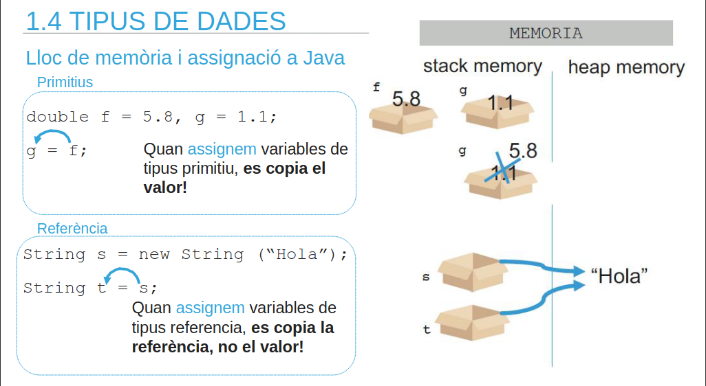
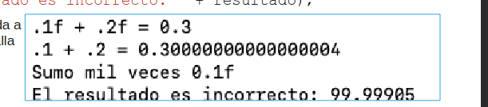
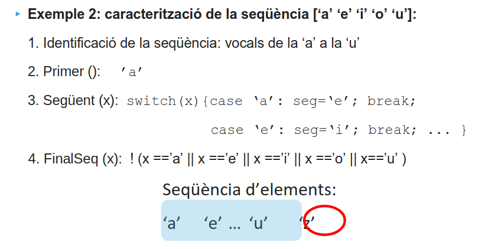
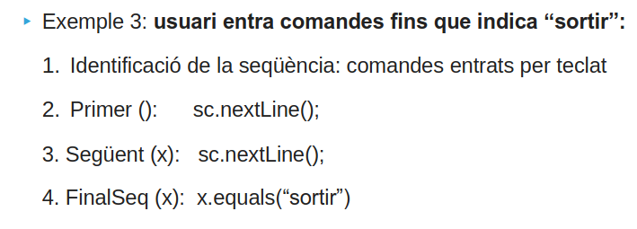
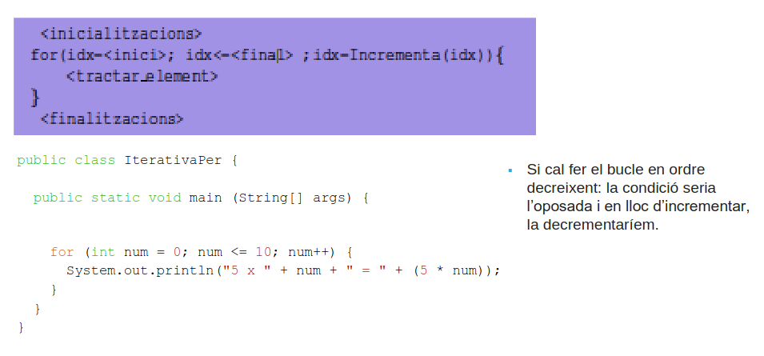
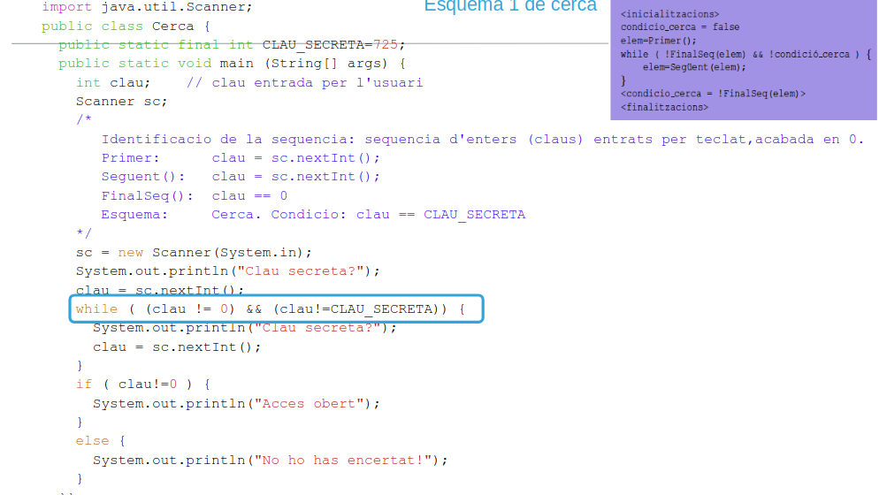
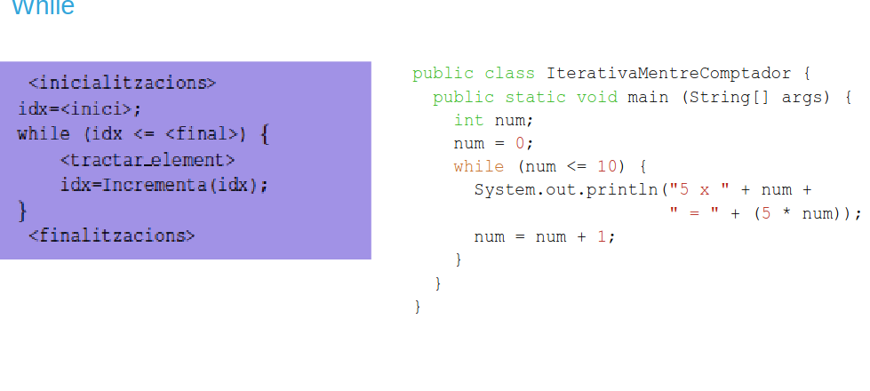
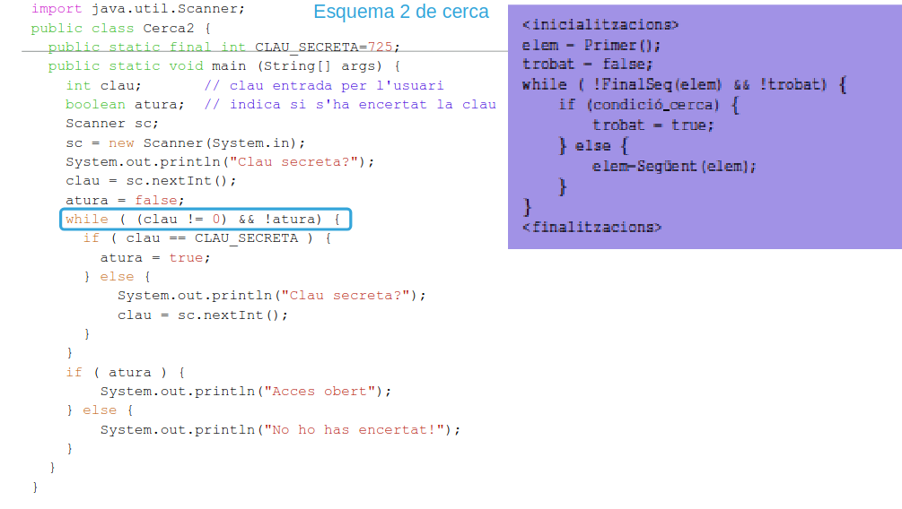
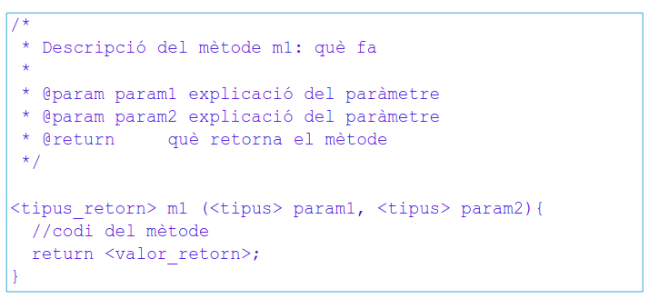

# Study Sheet Examen

## Declaració de Variables:

```java
tipusVariable nomVariable [ = valorInicial];
```

## CONSTANTS 

```java
final double nota = 10.0;
```

## ASSIGNACIONS




Per comparar referències s.equals(t);


## FORMAT DE NÚMEROS A JAVA:

```java
import java.util.*;

double numero = 123.456789;
String formato = String.format("%.2f", numero); // 2 decimales
System.out.println(formato);
```
```java
System.out.printf("Constant PI amb dos decimals: %.2f\n", pi);
```



## ENUM

```java
op = Operacio.values()[operacioEntrada];

Operacio.valueOf(operacioEntradaS) // per fer-ho amb Strings
```

## String van per referència

```java
s3.substring(1,2)
```

## Intercanvi de variable sense variable temporal


## Operador Ternari

### (<condició>) ? <sentènciesV> : <sentènciesF>

```java
resposta = (edat >= 18) ? "Sí" : "No";
```
## Bucle for amb step 2

```java
public class prova33 {
    public static void main(String[] args) {
        for (int i = 0; i <= 10; i += 2){
            System.out.println(i);
        }
    }
}
```

## Bucle Do While


```java
Si (Sentències inicials)
do {
< S (Sentències) >
} while (condició_booleana)
Sf (Sentències finals)
```

## Seqüències




**FinalSeq() = primer nombre fora de la seqüència**

## Esquema de Recorregut:


## Esquemes de cerca





## Funcions

### Paràmetres
- Formals: Definició.
- Actuals: Crida.

```java
static int suma (int a, int b){
    int c = a + b;
    return c;
}
```

## Tipus de Mètodes

Mêtodes de Classe:
- static sense crear un objecte de classe.

Mètodes d'Objecte:
- Es criden amb un objecte.

## Definició de Mètodes:


## Pas de Paràmetres

### Pas per Valor o per còpia
- Si el paràmetre es tipus primitiu: els valors que es modifiquen dintre del
mètode es fan sobre la variable local al mètode (el paràmetre formal), per
tant el paràmetre actual NO està modificat al finalitzar el mètode.

A java es passa tot per valor.