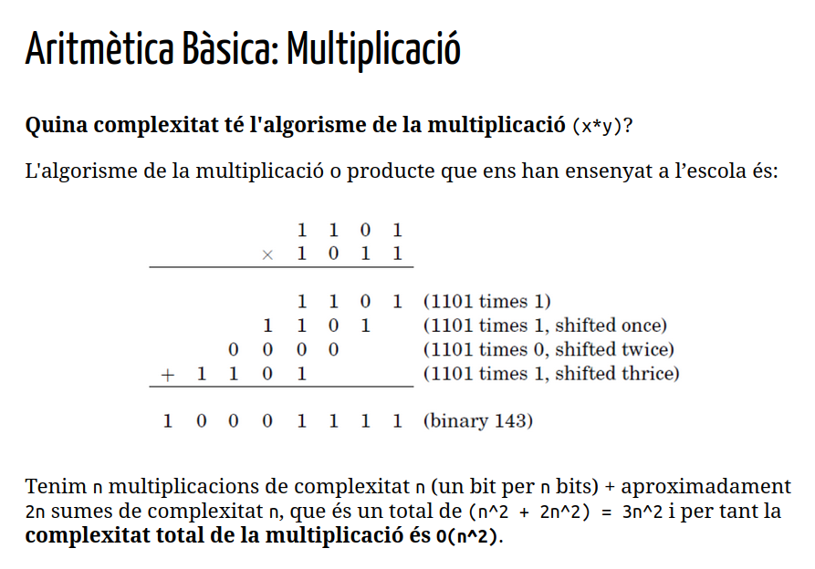
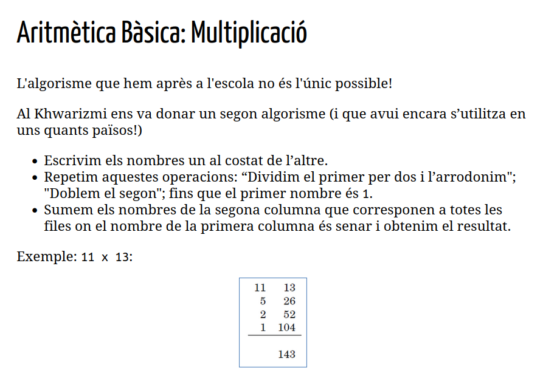
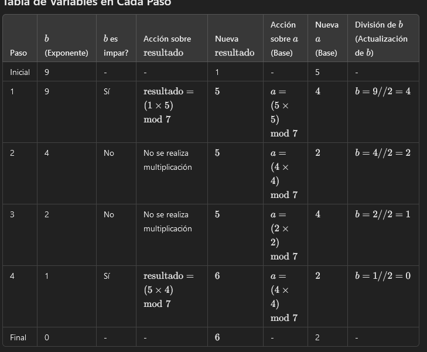

# STUDY SHEET PARCIAL 1 POL SANCES GUIRAO

##  1. INTRODUCCIÓ A L'ALGORÍSMICA

### 1.1 Definició D'Algorisme

Un algorisme és qualsevol procediment computacional que pren un o una sèrie de dades coma a entrada i genera uns altres com a sortida.

### Definició de Correcció

Un algorisme és correcte si podem demostrar matemàticament que retorna la sortida desitjada per a qualsevol entrada legal. (Arrel per numeros n>0).

### Definició d'eficiència.

Un algorisme és eficient si es fa amb el mínim nobre de recursos possible.


### Elements dels Llenguatges de Programació

- Símbols: Són la forma d'escriure variables i/o instruccions.

- Sintaxi: Són les regles que defineixen les combinacions vàlides de símbols: 3.2 + 4.5.

- Semàntica estàtica: 3.2/"abc" és sintàcticament correcte perquè l'expressió (<literal><opeardor><literal>) ho és però no ho és des del punt de vista de la semàntica estàtica.
Python només detecta alguns d'aquests errors.

- Semàntica: Es refereix a què fa el programa. Ex: Aquest progrma calcula l'arrel quadrada?.


## 2. ALGORISMES NUMÉRICS 1

### 2.1 La Seqüència de Fibonacci


Es plantejen diferents algorismes per trobar l'enèssim nombre de fibonacci.

#### 2.1.1 Algorisme Plantejat 1 (algorisme Recursiu)

```python
def fib1(n):
    if n==0:
        return n
    if n==1:
        return n
    else:
        return fib1(n-1) + fib1(n-2)
```

El que fa aquest algorisme és cridar-se a si mateix, fins al 1 o al 0, i després poc a poc es va sumant els valors de cada resultat.
És a dir que arriba fins a fib(0) = 0, i després va pujant un altre cop, fib(1) = 1, fib(2) = fib(1)+ fib(1) = 1 +1 = 2.


- Correció: Aquest algorisme és correcte ja que segueix exactament la definició.

- Eficiència: Trigarà molt, ja que per calcular el terme 200, hauria de fer $ 2^{138} passos. $

**Identificació del Problema**

- Hi ha molts càlculs que es repeteixen, una solució possible, és guardar el resultat de cada crida el primer cop que ho calculem.


#### Algorisme basat en llistes:

```python
def fib2(n):
    if n==0:
        return 0
    ls = [0,1]
    for i in range(2,n+1):
        ls.append(ls[i-1]+ls[i-2])
    return ls[n]
```

- Correcció: És correcte ja que segueix la definició.

- Eficiència: Només s'executa n-1 vegades per tant la complexitat és O(n) l'únic defecte és que consjmeix molta memòria la llista.

#### Algorisme Final

```python

def fib3(n):
    a,b = 0,1
    for i in range(1,n+1):
        a,b = b, a+b
    return a
fib3(10)
> 55

```

### 2.2 LA NOTACIÓ GRAN O

Compta els passos aproximats que fa un algorisme per comptar la seva comlexitat.

En aquest cas lal Gran 0 agafa sempre el pitjor dels casos, si és $ 2n^{3} + 5n^{2} + 10n + 10 $ agafa $ O(n^{3}) $

$ O(n!) > O(n^2) > O(n \cdot log(n)) > O(n) > O(log(n)) > 0(1) $

**Observacions:**

- Qualsevol Factorial és inútil a Partir de n = 20
- Els algorisme de 2^n son inútils a partir de n = 40
- Els alforismes n^2 comencen a ser costosos a partir de n = 10000 i inútils a n = 1 M
- Els algorismes n i n log(n) poden arribar fins a 1000 M.
- Els algorismes log(n) són útils per a qualsevol n.


## 3. ARITMÈTICA BÀSICA

### 3.1 PRELIMINARS

- Un canvi de base no afecta a la "mida" del nombre. Una complexitat serveix per a totes les altres bases.

### SUMA
- La suma de tres nombres amb n dígits, només ens pot donar un nombe màxim amb n+1 digits, per bases b >= 2.

La seva complextitat és O(n) perquè fem un nombre de sumes de dos dígits que és proporcional a la mida del nombre.

### MULTIPLICACIÓ


També està l'algorisme d'Al Khwarizmi.



Que traslladat a algorisme recursiu és:
```python
def mult(x,y):
    import math
    if y==0 or x==0:              # en aquest cas arribem a 0
        return 0
    z = mult(math.floor(x/2),y)   # fem les crides reduint x
    if x%2 == 0:
        return 2*z                # en el retorn és quan doblem y  
    else:
        return y+2*z              # només si és senar el sumem
print(mult(11,13))
```
La seva complexitat es pot deduir fent aquestes dues observacions:
- L'algorisme s'acab després de n crides recursives. 
- A cada crida recusriva fem n operacions.
- O(n^2)

### Divisió

$ x/y = y \cdot q + r $

```python
def div(x,y):
    import math
    if x<=0:
        return 0,0
    if y==1: 
        return x,0
    q,r = div(math.floor(x/2),y)
    q = 2*q              #desfem la divisió per 2
    r = 2*r              #desfem la divisió per 2 
    if x%2 != 0:
        r += 1           #recuperem el que hem perdut amb el floor
    if r >= y:
        r = r-y          
        q = q+1          #aquí és on anem augmentant el quocient
    return q,r
```


Complexitat O(n²)


## ALGORISMES NUMÈRICS 2

### ARITMÈTICA MODULAR

**Com enviar un missatge secret: **
1. p=11 i q=3 (Escollit 2 nombres primers) 
2. n = pq , n = 11*3 = 33 
3. m = (p-1)(q-1) ; 2*10 = 20.
4. ed % m = 1 ; 3*7 % 20 = 1
5. Clau Pública (n,e) i Clau Privada (n,d) ; (33,3)(33,7)

6. Encriptar Missatge M = 14 --> $ M^{e} \space \% \space n =  14^{3} \space \% \space 33 = 5 $
7. El missatge encriptat s'envia a l'Alice i resultat = $ C^{d} \space \% \space n = 5^{7} \space \% \space 33 = 14$


**Definció de Mòdul de N**

$ x \space \% \space n $

Exemple: $ 12 \space \% \space 7 = 5$

Això ens permet definir un equivalència (congruència) entre números.

$ x \text{ és congruent amb } y <-> N dvideix (x-y) $

* O(n^2)

#### SUMA MODULAR (a + b % n)

$ (a + b) \space \% \space n = (a \space \% \space n  + b \space \% \space n) \space \% n$

A més, sabem que si dos nombres estan el rang [0, N-1] (a % N i b % N ho estan), la seva suma està en el rang [0, 2(N-1)] (que només és un bit més). 

Complexitat: O(n)

#### MULTIPLICACIÓ MODULAR

$ (a * b) \space \% \space n = (a \space \% \space n  * b \space \% \space n) \space \% n$

A més, sabem que el producte pot ser fins (N-1)^2 i que això es pot representar amb 2n bits. Per transformar el resultat hem de dividir per N i calcular el mòdul (amb complexitat O(n^2))


#### DIVISIÓ MODULAR 
No és tan simple però té una complexitat de O(n^3).

#### EXPONENCIACIÓ MODULAR

x^y amb operadors molt grans necessiten molt bits per emmagatzemar, en canvo només necessiten log(n) digits per representar-se.




Exemple d'Algorisme Recursiu:
```python
def modexp(x,y,N):
    import math
    if y == 0:
        return 1    # cas base x^0 dona 1
    z = modexp(x, math.floor(y/2), N)  
                  # dividim la potència per 2 fins arribar al cas base  
    if y%2 == 0:
        return (z**2)%N
                # anem fent les potències de 2 mòdul N
    else:
        return (x*(z**2))%N
                # la y inicial no és una potència de 2, 
                # cal multiplicar per x, també mòdul N
```


Exemple d'Algorisme No recursiu:

```python
def exponenciacion_modular(base, exponente, modulo):
    # Inicializamos el resultado en 1
    resultado = 1
    
    # Aseguramos que la base esté dentro del rango del módulo
    base = base % modulo
    
    # Mientras el exponente sea mayor que 0
    while exponente > 0:
        # Si el bit menos significativo de 'exponente' es 1, multiplicamos el resultado por la base
        if exponente % 2 == 1:
            resultado = (resultado * base) % modulo
        
        # Cuadramos la base (base^2) y aplicamos el módulo
        base = (base * base) % modulo
        
        # Dividimos el exponente entre 2 (desplazamiento a la derecha)
        exponente //= 2
    
    return resultado
```

### NOMBRES PRIMERS

Factorització és dura però primeritat és fàcil.

**Petit teorema de Fermat**
Si p és primer, llavors per a qualsevol enter a, 1 <= a < p, es compleix que a^(p-1) % p = 1. 

```python
import random
def fermat(num, test_count):
    if num == 1:
        return False
    for x in range(test_count):
        val = random.randint(1, num-1)     
        if pow(val, num-1) % num != 1:      
            return False                   
    return True
fermat(41652,10)
> True
```

- El problema és que només podem saber uns quants casos, no tots!
- No diu què passa quan N no és primer.

Complexitat O(n^3)

Per Tant, els alfgorismes de més alta complexitat en un procés criptogràfic tenen O(n^4).


## ALGORISMES DE TEXT

### ALGORISME INGÈNU PASSAR PER TOTS I BUSCAR LA PARAULA.

- No és eficient.
- Complexitat O(n*m)

### ALGORISME DE HORSPOOL

Aquest Algorisme preprocessa el patró i fa salts segons la distància assignada.

Complexitat O(n*m), que tot i ser igual és més eficient que el de força bruta.

