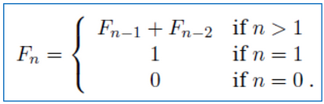
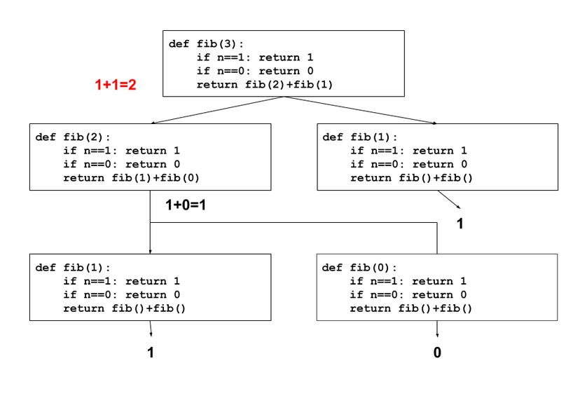

# STUDY SHEET PARCIAL 1 POL SANCES GUIRAO

##  1. INTRODUCCIÓ A L'ALGORÍSMICA

### 1.1 Definició D'Algorisme

Un algorisme és qualsevol procediment computacional que pren un o una sèrie de dades coma a entrada i genera uns altres com a sortida.

### Definició de Correcció

Un algorisme és correcte si podem demostrar matemàticament que retorna la sortida desitjada per a qualsevol entrada legal. (Arrel per numeros n>0).

### Definició d'eficiència.

Un algorisme és eficient si es fa amb el mínim nobre de recursos possible.


### Elements dels Llenguatges de Programació

- Símbols: Són la forma d'escriure variables i/o instruccions.

- Sintaxi: Són les regles que defineixen les combinacions vàlides de símbols: 3.2 + 4.5.

- Semàntica estàtica: 3.2/"abc" és sintàcticament correcte perquè l'expressió (<literal><opeardor><literal>) ho és però no ho és des del punt de vista de la semàntica estàtica.
Python només detecta alguns d'aquests errors.

- Semàntica: Es refereix a què fa el programa. Ex: Aquest progrma calcula l'arrel quadrada?.


## 2. ALGORISMES NUMÉRICS 1

### 2.1 La Seqüència de Fibonacci



Es plantejen diferents algorismes per trobar l'enèssim nombre de fibonacci.

#### 2.1.1 Algorisme Plantejat 1 (algorisme Recursiu)

```python
def fib1(n):
    if n==0:
        return n
    if n==1:
        return n
    else:
        return fib1(n-1) + fib1(n-2)
```

El que fa aquest algorisme és cridar-se a si mateix, fins al 1 o al 0, i després poc a poc es va sumant els valors de cada resultat.
És a dir que arriba fins a fib(0) = 0, i després va pujant un altre cop, fib(1) = 1, fib(2) = fib(1)+ fib(1) = 1 +1 = 2.



- Correció: Aquest algorisme és correcte ja que segueix exactament la definició.

- Eficiència: Trigarà molt, ja que per calcular el terme 200, hauria de fer $ 2^{138} passos. $

**Identificació del Problema**

- Hi ha molts càlculs que es repeteixen, una solució possible, és guardar el resultat de cada crida el primer cop que ho calculem.


#### Algorisme basat en llistes:

```python
def fib2(n):
    if n==0:
        return 0
    ls = [0,1]
    for i in range(2,n+1):
        ls.append(ls[i-1]+ls[i-2])
    return ls[n]
```

- Correcció: És correcte ja que segueix la definició.

- Eficiència: Només s'executa n-1 vegades per tant la complexitat és O(n) l'únic defecte és que consjmeix molta memòria la llista.

#### Algorisme Final

```python

def fib3(n):
    a,b = 0,1
    for i in range(1,n+1):
        a,b = b, a+b
    return a
fib3(10)
> 55

```

### 2.2 LA NOTACIÓ GRAN O

Compta els passos aproximats que fa un algorisme per comptar la seva comlexitat.

En aquest cas lal Gran 0 agafa sempre el pitjor dels casos, si és $ 2n^{3} + 5n^{2} + 10n + 10 $ agafa $ O(n^{3}) $

