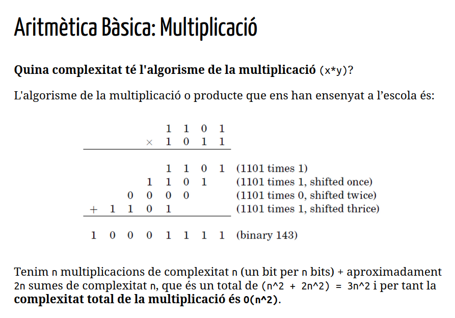
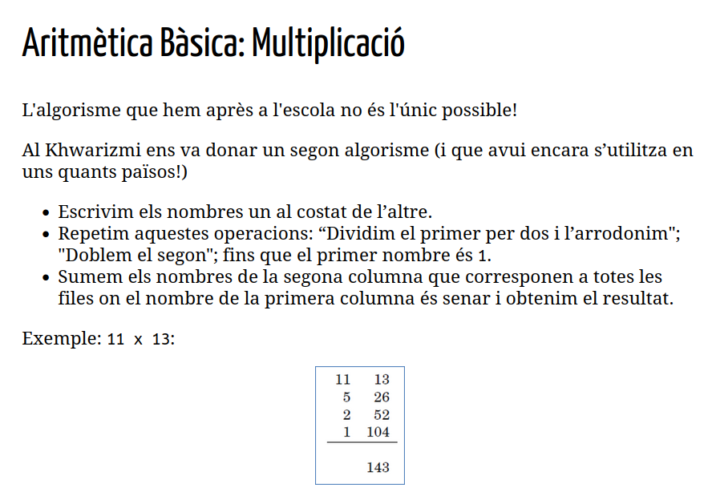

# Algorismes Numèrics I

## Bases i Nombres

Una base representa la cardinalitat d'un conjunt:

642 és 600 + 40 + 2

Aquesta fòrmula seria:

$ d_n · R^{n-1} + ... + d_2 · R + d_1$

D'aquí surt que:

$ 642 = 6_3·10^2 + 4_2·10¹ + 2_1 * 10⁰  $

Les bases importants en informàtica:
- Decimal
- Binària
- Hexadecimal

## Algorisme Definitiu de Fibonacci

```python
def fib3(n):
    a,b = 0,1
    for i in range(1, n+1):
        a,b = b, a+b
    return a

fib3(10)
55
```

Notació O Gran:

    Constant, O(1), com f(n) = min(n,1), que no depenen de n.
    Logarítmic, O(log(n)).
    Lineals, O(n).
    Super-lineals, O(nlog(n)).
    Quadràtics, O(n^2).
    Cúbics, O(n^3).
    Exponencials, O(c^n) per c>1.
    Factorials, O(n!)


## ARITMÈTICA BÀSICA

- Si fem un canvi de base a un nombre no canvia la compelxitat de l'algoritme.

### SUMA
- La suma de de dos nombres amb n dígits, només ens pot donar un nombe màxim amb n+1 digits.

La seva complextitat és O(n) perquè fem un nombre de sumes de dos dígits que és proporcional a la mida del nombre.

### MULTIPLICACIÓ


També està l'algorisme d'Al Khwarizmi.


Que traslladat a algorisme recursiu és:
```python
def mult(x,y):
    import math
    if y==0 or x==0:              # en aquest cas arribem a 0
        return 0
    z = mult(math.floor(x/2),y)   # fem les crides reduint x
    if x%2 == 0:
        return 2*z                # en el retorn és quan doblem y  
    else:
        return y+2*z              # només si és senar el sumem
print(mult(11,13))
```
La seva complexitat es pot deduir fent aquestes dues observacions:
- L'algorisme s'acab després de n crides recursives. 

### Divisió

$ x/y = y \cdot q + r $

def div(x,y):
    import math
    if x<=0:
        return 0,0
    if y==1: 
        return x,0
    q,r = div(math.floor(x/2),y)
    q = 2*q              #desfem la divisió per 2
    r = 2*r              #desfem la divisió per 2 
    if x%2 != 0:
        r += 1           #recuperem el que hem perdut amb el floor
    if r >= y:
        r = r-y          
        q = q+1          #aquí és on anem augmentant el quocient
    return q,r

COmplexitat O(n²)


# ALGORISMES NUMÈRICS PART 2
